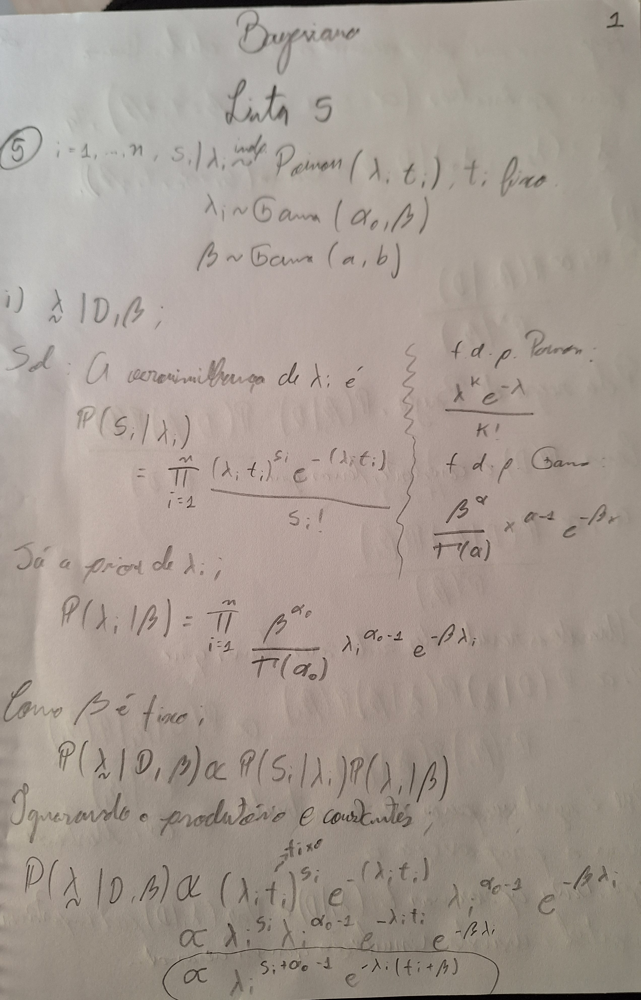
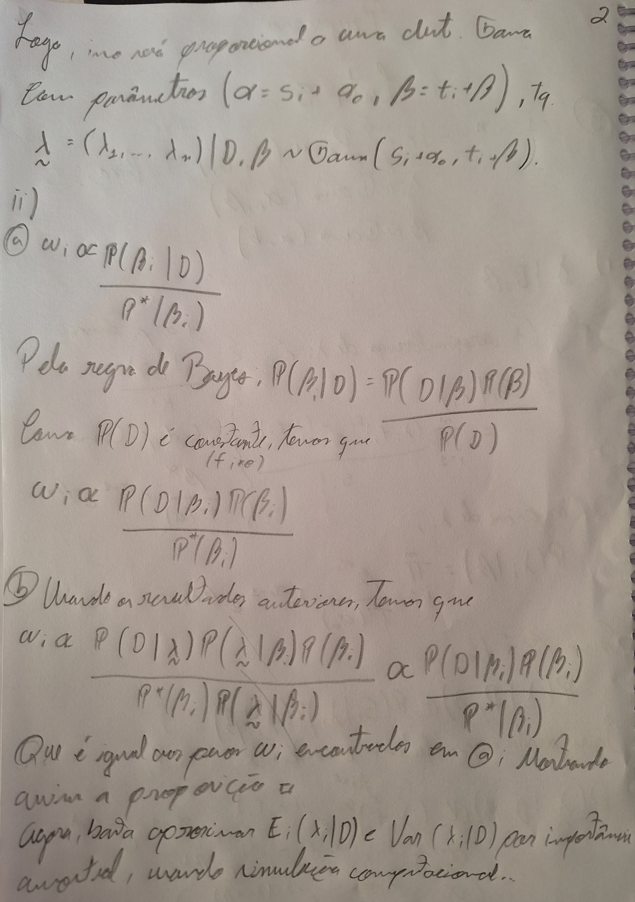

\begin{center}
{\Large
  DEPARTAMENTO DE ESTATÍSTICA} \\ [0.5cm]
\begin{figure}[!t]
\centering
\includegraphics[width=9cm, keepaspectratio]{logo-UnB.eps}
\end{figure}
{\large
  `r format(Sys.time(), '%d %B %Y')`} \\[0.5cm]
{\LARGE
  \textbf{Trabalho}} \\[0.5cm]
{\Large
  Prof. Dr. Donald Matthew Pianto} \\[0.5cm]
{\Large
  Aluno: Bruno Gondim Toledo} \\[0.5cm]
{\Large
  Matrícula: 15/0167636} \\[0.5cm]
{\Large
  Inferência Bayesiana} \\[0.5cm]
{\Large
  1º/2024} \\[0.5cm]
\end{center}

\newpage

```{r setup, include=F}
if (!require("bang")) install.packages("bang")
if (!require("knitr")) install.packages("knitr")
```

```{r, echo=FALSE, out.width = '100%'}

```

```{r, echo=FALSE, out.width = '100%'}

```


\newpage

# Lista 5

## Questão 5

Aproximação por importância amostral para $\mathbb{E}(\lambda_i|D)$ e $Var(\lambda_i|D)$, utilizando $\alpha_0=0,166;a=0,1;b=0,01$, para o conjunto de dados *pump*, disponível no pacote *bang*

```{r}
# Dados (Disponível no pacote bang)
library(bang)
D <- as.data.frame(pump)

# Parâmetros
alfa0 <- 0.166
a <- 0.1
b <- 0.01
s <- D$failures
t <- D$time
n <- 1000 # Número de amostras

pesos <- numeric(n)
amostras_beta <- matrix(0, nrow=n, ncol=nrow(D))
beta <- rgamma(n, shape=a, rate=b)

for (i in 1:n) {
  beta_i <- beta[i]
  amostras_beta[i, ] <- rgamma(nrow(D), shape=s + alfa0, rate=t + beta_i)
  priori <- dgamma(beta_i, shape=a, rate=b)
  verossimilhanca <- prod(dpois(s, amostras_beta[i, ] * t))
  dist_proposta <- dgamma(beta_i, shape=a, rate=b)
  pesos[i] <- priori * verossimilhanca / dist_proposta
}

pesos <- pesos/sum(pesos)

medias <- colSums(amostras_beta * pesos)
variancias <- colSums((amostras_beta - medias)^2 * pesos)

D$esperanca_lambda <- medias
D$variancia_lambda <- variancias
D$bomba <- 1:10
D <- D[,c(5,1:4)]
colnames(D)[2:3] = c("n_falhas","tempo")
```

\newpage

Portanto, temos os valores de esperança e variância para cada $\lambda_i$:

```{r}
kable(D)
```

Desta tabela, conseguimos tirar algumas conclusões. Vemos uma variabilidade para os valores de $\lambda_i$ de `r round(min(D$esperanca_lambda),2)` à `r round(max(D$esperanca_lambda),2)`, mostrando que este valor difere bastante em relação à bomba observada. Isso pode estar relacionado a diversos fatores, como idade da bomba ou fabricante. A variância deste parâmetro em geral foi baixa, salvo para as últimas bombas, o que indica que temos alguma precisão dessas estimativas. O algoritmo em sí funciona bem rápido para $n=1000$, não sendo uma grande questão computar estes valores. A modelagem *Poisson* para este conjunto faz todo sentido, visto que temos visivelmente um processo de Poisson a tempo contínuo, com um intervalo de exposição dado e uma contagem de sucessos, porém vemos que a modelagem bayesiana é mais interessante neste caso que a frequentista por fornecer valores mais apropriados para os parâmetros, visto que numa aborgadem frequentista utilizariamos a propriedade da Poisson de que $\mathbb{E}(\lambda) = \mathbb{V}(\lambda)$, o que até observamos para algumas bombas do conjunto, porém algumas o valor da variância é significativamente diferente do valor da média, observada a escala dos números. É interessante também observar na prática o isomorfismo da Poisson com a Gama, visto que foi esta a distribuição utilizada para gerar os valores de $\lambda_i$.

\newpage

## Questão 6

Repetindo o exercício anterior, porém utilizando amostrador Gibbs

```{r}
D <- as.data.frame(pump)

# Parâmetros
alfa0 <- 0.166
a <- 0.1
b <- 0.01
s <- D$failures
t <- D$time
n <- 5000 # Número de amostras
beta <- 0 # Valor inicial para iniciar o loop "não informativo" para Beta

amostras_lambda <- matrix(0, nrow=n, ncol=nrow(D))

for (i in 1:n) {
  lambda_i <- rgamma(nrow(D), shape=s + alfa0, rate=t + beta)
  beta <- rgamma(1, shape=a + nrow(D) * alfa0, rate=b + sum(lambda_i))
  amostras_lambda[i, ] <- lambda_i
}

df <- as.data.frame(t(amostras_lambda[1001:5000,])) # Removendo primeiras 1000 amostras (burn-in)
df$esperanca_lambda <- apply(df, 1, mean)
df$variancia_lambda <- apply(df, 1, var)
df = df[,4001:4002]

D = cbind(D,df)
D$bomba = 1:10
D = D[,c(5,1:4)]
colnames(D)[2:3] = c("n_falhas","tempo")

```

Portanto, temos os valores de esperança e variância para cada $\lambda_i$:

```{r}
kable(D)
```

A tabela é idêntica à anterior, senão pela estimativa dos parâmetros pelo método utilizado aqui. Este algoritmo foi até mais simples de implementar que o anterior. Foi definido um tamanho amostral maior $n=5000$, por conta da necessidade de eliminar algumas amostras (*burn-in*, ou seja, eliminar algumas amostras até que o valor de $\beta$ comece a "caminhar" pelo espaço paramétrico, visto que colocamos um valor inicial arbitrário $\beta=0$). Foram eliminadas as primeiras 1000 amostras como *burn-in*. O tempo de execução é extremamente parcimonioso. Quanto as estimativas produzidas, a esperança de lambda é praticamente igual idependente do método, porém a variância aqui foi menor para as últimas bombas, mostrando que este método é bastante robusto para produzir estimativas sobre os parâmetros.